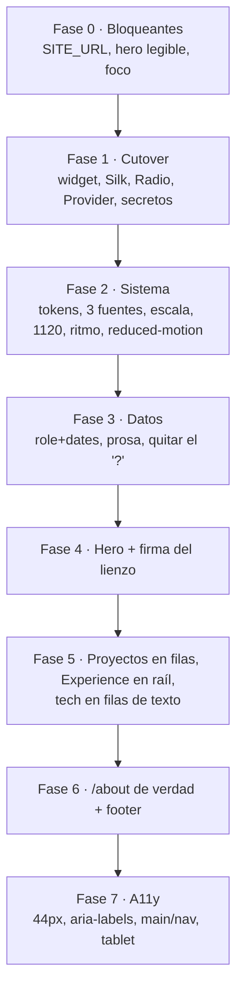

# Rediseño luqueee.dev — plan de trabajo

> **Estado: nada de esto está implementado.** Este documento es el plan.
>
> **Evidencia detrás de cada número:** auditoría de código sobre 24 ficheros de `src/`;
> las 8 webs de referencia de `ideas.txt` medidas vía `getComputedStyle` / `document.fonts`
> en DOM real; y esta web arrancada con `next dev` y medida en Chromium a 1440×900 y 390×844
> (`getBoundingClientRect`, contraste calculado, diffs de píxeles, `document.getAnimations()`).
> Decisiones persistidas en `.tokensave/` vía `record_decision` #1 y #2.

---

## 0. Resumen

Tres cosas, en este orden:

1. **Hay tres bugs que pesan más que cualquier decisión estética** (§1). Sin `SITE_URL` la web entera sirve una página de error blanca.
2. **No hay sistema de diseño que reformar** (§3): una fuente, un color de texto para cuatro niveles de jerarquía, un valor de espaciado, cero croma, tres anchos de contenedor compitiendo.
3. **El hero actual es rafaelamaral.dev copiado a medias.** Rafael pone `FULLSTACK`/`DEVELOPER` a 96px en Avantgarde sobre negro puro con "Based in Portugal" bajo el nombre; aquí están las mismas dos palabras a 128px en Inter, sin el sistema que las sostiene. La dirección nueva (§3) es propia y sale del sujeto, no de la referencia.

Fuera: el widget de Spotify, el shader Silk, el cluster Radio, `Provider`/react-query y el tic de "glow".

---

## 1. Fase 0 — Bloqueantes (esto no es estética)

| | Problema | Medición | Sitio |
|---|---|---|---|
| **B1** | Sin `SITE_URL`, **toda ruta** sirve el error shell de Next: blanco, sin estilos, fuente del sistema | `ogUrl(process.env.SITE_URL!)` → `new URL("/api/og", undefined)` → `ERR_INVALID_URL`, digest `4268254594`, dentro de `generateMetadata` del root layout. Medido: `document.title` vacío, `html id=__next_error__`, `background: rgb(255,255,255)`, `0` secciones. **No existe `.env`, `.env.local` ni `.env.example`** | `src/app/layout.tsx:30` → `src/lib/og.ts:24` |
| **B2** | El H1 se desvanece hasta ser ilegible | Relleno `linear-gradient(…, #302f2f 100%)` sobre `#0e100f` → **1.43 : 1**. Cruza el mínimo de 3:1 al **~84% de la caja**: la mitad inferior de `DEVELOPER` incumple WCAG, y es el *estado final animado* (degrada al cargar) | `src/components/hero/Hero.tsx:35` |
| **B3** | El nombre del dueño no tiene valor de color | `color: rgba(0,0,0,0)` **y** `-webkit-text-fill-color: rgba(0,0,0,0)`. Los glifos existen solo por `background-clip: text` → en forced-colors, al imprimir o si falla el paint, **el nombre es invisible**. Sin fallback | `src/components/hero/Hero.tsx:12-22` |
| **B4** | El canvas del shader tapa el hero y roba los clics | `elementFromPoint(720,450)` en el centro del hero devuelve **`CANVAS`**; el hero no se puede seleccionar. Wrapper `fixed` con `-z-0` → `z-index: 0`, que **pinta por encima** del contenido en flujo: velo blanco al 10% sobre todo el texto | `src/app/layout.tsx:121-129` |
| **B5** | Cero indicador de foco en todo control que no sea del nav | `outline-style: none` + las 5 capas de `box-shadow` con alpha 0 mientras `:focus-visible` hace match. Verificado ópticamente: el diff de control sin cambio de foco (1598 px) supera al del par enfocado/no-enfocado (986 px). **Causa: sintaxis `ring` de Tailwind v3 en build v4** — `outline-none` aplica, el `ring` nunca compone en `box-shadow` | los 6 botones copiados + `ui/button.tsx` |
| **B6** | Interval sin cleanup martilleando Redis | `setInterval(fetchSong, 10000)` sin función de limpieza (y el comentario dice 60 s) → server action → `ECONNREFUSED ::1:6379` cada 10 s, para siempre, en toda página | `src/components/spotify/SpotifyCard.tsx:18` |
| **B7** | Secretos comiteados | `client_id` de Spotify en claro y una **IP de producción** `207.180.214.117` | `src/app/api/spotify/callback/route.ts:59,61` (siguen en el historial de git) |

**Aceptación de la fase:** `.env.example` en el repo, `SITE_URL` con fallback razonable en lugar de `!`, hero legible en toda su altura, hero seleccionable, anillo de foco visible en los 10 controles interactivos.

---

## 2. El brief

**Sujeto fijado:** Adrià construye cosas a las que otra gente se conecta.

- **RemoteCord** — controla tu PC desde un bot de Discord. Tauri + Nest.js + Redis + Pm2 + Docker.
- **drawit.place** — clon de r/place. Un lienzo de píxeles compartido. Next.js + Postgres + Redis + Nest.
- **Kenabot** — uno de los bots de música más grandes de España (frontend).
- **TaxiPrime** — diseño + desarrollo + SEO.
- Formación: CFGM en **Sistemas Microinformáticos y Redes** (2023–2025) + **6 años en Codelearn empezando en 2016**.
- Competitivo: Codejam (Institut Sabadell), HP CodeWars **14/130**.

No es un "creative frontend". Es **tiempo real e infraestructura**: sockets, presencia, Redis, demonios, un lienzo que pintan desconocidos. La web actual no dice nada de eso; dice "Inter, negro, tarjetas".

### Lo que enseñan las referencias que le gustan (medido, no intuido)

|  | andrijaweb | rafaelamaral | duyle |
|---|---|---|---|
| Usos totales de acento en toda la página | **11** | **0** | **9** |
| Foreground | `#E7E5E4` (cálido) | `#F9FAFB` | `#FAFAFA` |
| Filete | un `#404040` ×24 | un `#D4D4D4` | un `#E5E5E5` ×30 |
| `box-shadow` significativa | ninguna | ninguna | ninguna |
| Titular de sección | izquierda, 48px | izquierda, **20px/300** | izquierda, **badge 12px** |
| Columna | 1280px | **768px** | **576px** |
| Tarjetas | solo proyectos | solo proyectos | solo proyectos |
| Motion | scroll reveals | **solo carga** | ninguno (loops + juguetes) |

Conclusiones que gobiernan este plan:

- Las tres son **casi monocromas**. El problema aquí no es que falte acento: es que **no hay acento que retener**.
- Se estructuran con **un solo filete de 1px**. Cero sombras.
- **Nadie centra un titular de sección.** Solo el hero va centrado, y ni eso siempre.
- **Lo memorable es siempre un detalle personal real, nunca un efecto**: "BASED IN SERBIA", avatares de colaboradores, un mapa en vivo de su ubicación.
- **Ninguna tiene un overlay flotante en una esquina.** Todas ponen el dato personal **dentro de la columna, en el flujo de lectura**. El widget de Spotify era el instinto correcto en el sitio equivocado.
- **Ninguna respeta `prefers-reduced-motion`** (solo tedawf). Aquí se les gana.

### Qué sería un error copiar

- **El cableado de Geist de duyle.** Declara Geist, define `--font-geist-sans`, nunca apunta `--font-sans` a él: `document.fonts.check('16px Geist') === false`, **0 de 1261 elementos** lo usan. Renderiza el stack de UI del sistema.
- **Los filetes casi blancos de rafael sobre negro puro.** 1px `#D4D4D4` sobre `#000` es un borde muy ruidoso; sus tags con relleno `#E5E5E5` y texto negro parecen pegatinas.
- **El scroll-reveal de andrija.** Su página está en blanco bajo el fold hasta que corre el IntersectionObserver. **Es exactamente el bug actual de esta web** (§5, D10).
- **El hero de 4 colores de thegr8binil** y **los watermarks de 288px a peso 200 de supermoooo**. Ambos en el montón de *no me gustan*.
- **El tic `blur-xs animate-pulse -z-10`.** Sin precedente en ninguna de las 8 referencias.

---

## 3. Sistema de diseño

### 3.1 Color — tinta ámbar sobre pizarra fría

> El `--background` actual es `oklch(17.034% 0.00382 164.819)`. **Hue 164.8 es verde-cian**: el negro tiene un tinte verde por accidente.

| Token | Valor | Uso |
|---|---|---|
| `--base` | `#0B0C0E` | fondo. Frío, 2 puntos sobre negro puro — nunca `#000` |
| `--raised` | `#14171A` | superficie elevada |
| `--line` | `#23272C` | **el filete. Uno. En todo el sitio.** 1px |
| `--muted` | `#79818B` | metadatos, fechas, captions, body secundario |
| `--fg` | `#E6E9EC` | texto principal. Off-white **frío**, no `#fff` |
| `--ink` | `#FFB000` | **acento: ámbar de fósforo** |

**Por qué `#FFB000` y no lo obvio.** Descartados con motivo:

- **Vermellón / verde ácido** → es el cliché nº2 de diseño generado por IA ("casi-negro + un acento brillante").
- **`#FF4500`** (naranja de r/place) → temáticamente perfecto, pero cae de lleno en ese mismo cliché.
- **`#3B82F6`** → es literalmente el acento de andrija. Copiar.
- **Blurple de Discord `#5865F2`** → marca prestada, y prácticamente el mismo azul.

El ámbar de fósforo sale de su mundo real: es el monitor de terminal, y viene de *Sistemas Microinformáticos y Redes*, Pm2, Docker, Redis. Cálido sobre base **fría** produce una tensión que el cream-y-terracota no tiene.

**Regla de disciplina — `--ink` es tinta, nunca relleno.** Filetes, eyebrows, el caret, el punto de presencia, el `14/130`. **Máximo ~12 usos en toda la página** (igualando los 11 medidos en andrija). **Cero botones ámbar sólidos.**

**Paleta de r/place, confinada.** `#FF4500 #FFD635 #00A368 #3690EA #B44AC0` solo dentro del elemento firma (§3.5) y de la ficha de drawit.place. Es la paleta que su propio proyecto le da al usuario. **No se derrama al resto** — 5 secciones con 5 colores distintos es el modo de fallo de thegr8binil.

### 3.2 Tipografía — tres roles, y por fin tracking

> Estado actual: una familia (Inter) y **`letter-spacing: normal` en absolutamente todos los elementos**, incluido el H1 de 128px. El salto body 16 → display 128 es **8×**, con todo el rango medio (20/24/30/36) apretado en 2.25×.

| Rol | Familia | Por qué esta |
|---|---|---|
| **Display** | **Archivo** variable, eje `wdth` 62–125 | Grotesco con **eje de anchura real**, que casi nadie usa. `Archivo Expanded 800` a `-0.035em` da un bloque de tipo industrial y denso que Inter no puede producir. El eje de anchura es la decisión no-default |
| **Texto** | **Instrument Sans** variable | Excelente a 16px, discretamente con carácter. **No Inter** (default), **no Geist** (ver §2) |
| **Utilidad / dato** | **Departure Mono** (self-hosted) | Aquí vive la voz de píxel/terminal: eyebrows, años, tags de stack, línea de presencia, `14 / 130`. Mono como voz real está validado por duyle y encaja con un dev de sistemas |

> Una pixel-font para el display se descartó: a 88px se lee como videojuego. La voz de píxel va a la mono, donde aporta y no grita.

**Escala, en dos regímenes** (como andrija), fluida con `clamp()` — **esto es lo que arregla el hueco 768–1023px**:

```
texto    ~1.2 :  12 (mono) · 14 · 16 · 20 · 24
display  ~1.5 :  36 · 56 · 88            ← 88, no 128
tracking      :  display −0.035em · eyebrow mono +0.12em MAYÚS · body 0
leading       :  display 0.92 · titular 1.1 · body 1.6
medida        :  68ch máx en prosa
```

**Display baja de 128 a 88px.** No es cobardía: 128px con tracking real ocupa casi lo mismo y *se lee*, y libera altura para que el hero tenga algo más que una palabra. Hoy el fold es una palabra gigante y 640px de vacío.

**Jerarquía tonal — el arreglo más barato y más grande.** Medido hoy: titular de sección 18.3:1, título de tarjeta 18.21:1, body 18.21:1, footer 18.22:1. **Cuatro niveles dentro de 0.1 el uno del otro, todos en `#fafafa`.** Nada está desenfatizado, así que nada está enfatizado. Nuevo reparto: `--fg` para titulares y body principal, `--muted` para metadatos, fechas y body secundario.

### 3.3 Layout — una medida, un raíl, ritmo con jerarquía

> Hoy la página nunca decide cuánto mide: contenido **900** / nav **1000** / footer **1000** / shell **1920**. El nav y el footer sobresalen **50px por lado** del contenido que enmarcan. En móvil el footer arranca en `x=16` y las secciones en `x=32` → **16px desalineado, visible a simple vista**.

- **Un solo shell: 1120px.** El nav y el footer comparten **exactamente** ese ancho.
- **Prosa a 68ch.** Hoy `/about` corre a **92–104 caracteres por línea** sobre una medida de 866px; el rango cómodo es 45–75. Esa es la razón real de que `/about` sea un muro.
- **Raíl de metadatos.** Dos pistas: columna estrecha de mono a la izquierda (año, estado, índice, resultado) + columna ancha de contenido. No es decoración `01/02/03` — **el raíl lleva los datos que ya existen**: `2023–2025`, `14 / 130`, `Institut Sabadell`, el stack. Y fuerza al modelo de datos a crecer (§7).
- **Ritmo con jerarquía**, no `mt-20` en todo. Hoy los cuatro límites de sección son **80/80/80/80**, así que el hueco entre dos bloques relacionados es idéntico al de dos que no lo están.

```
160px  entre movimientos
 64px  dentro de un movimiento
 24px  dentro de un bloque
```

- **Breakpoints reales.** Hoy `md:lg:` está en todo el sitio, y stackear dos variantes `min-width` las anida → `md:lg:X` **es exactamente `lg:X`**, la mitad `md:` es inerte. Resultado medido: **todo conmuta a 1024px**, 768–1023 recibe el layout de móvil, y a 1023px una captura se **escala 1.35×** (866×650 desde un original 640×480). Sitios: `Hero.tsx:42`, `Hero.tsx:95`, `Experience.tsx:14`, `Projects.tsx:14`, `NavBar.tsx:16`, `SpotifyCard.tsx:25,62`.

### 3.4 Movimiento — una estrategia

**Orquestado en carga** (el modelo de rafael) + hover discreto. Razón: el scroll-reveal es el modo de fallo actual — un render en frío es **~60% negro vacío en desktop y ~75% en móvil**, y la rejilla de tech está **550px en blanco a los 1.6 s** (`opacity: 1` solo a los 2.5 s). En móvil, deslizar produce tramos largos de negro con un titular flotando.

- Un fade-up escalonado de 600 ms al primer paint, `once: true`, y **el contenido visible por defecto** — nunca `opacity: 0` como estado SSR en reposo.
- **Se van:** los 19 `animate-pulse`, el shimmer infinito del hero, los 4 barridos blancos (`via-white opacity-30` a 700 ms — el hover más ruidoso del diseño), el shader.
- **El tic de glow muere entero.** Duplica el árbol de accesibilidad: `h3.textContent` es literalmente `"Currently working onCurrently working on"`, y la rejilla de tech renderiza **28 `` para 14 iconos con el mismo `alt`** (`TypeScript, TypeScript, Python, Python…`).
- **Se añade el bloque `prefers-reduced-motion` que no existe.** Hoy, bajo `reduce` emulado: **21 animaciones, las 21 corriendo, las 21 infinitas**; el gradiente del nombre sigue barriendo (`180.959% → 8.69012%` en 700 ms); el shader cambia **96 918 de 104 000 píxeles (93%)** entre frames separados 1.1 s. Cero coincidencias de `prefers-reduced-motion|useReducedMotion|motion-safe|motion-reduce` en todo `src/`.

### 3.5 Firma — el fondo es un lienzo pintable. Su lienzo.

Un campo de celdas de 16px detrás del hero. Al pasar el cursor **pinta celdas**, que decaen a los pocos segundos, con la paleta de r/place. 2D canvas o CSS grid + `rAF`, pausado fuera de viewport, desactivado entero bajo `prefers-reduced-motion`, `pointer-events` correctamente cedidos al texto.

Por qué esto:

- Es **literalmente su proyecto**. drawit.place es un lienzo compartido; el visitante pinta en su portfolio. Eso es "un detalle personal real y vivo", que es lo que hace memorables a las tres referencias — y **no es un mapa copiado**: el mapa de duyle funciona porque es *su* ubicación; copiarlo da "portfolio con mapa".
- **Sustituye al instinto del widget de Spotify en el sitio correcto**: dentro de la columna, en el flujo de lectura.
- Cuesta ~2 KB de JS. El shader Silk cuesta **35% del JS** para aportar `+3.54/255` de gris (§6).

**Dispositivo de apoyo, pequeño, en el hero:** una línea de presencia con vernáculo de Discord — `● construyendo Kenabot · Barcelona`. Es de su mundo, es una línea, y hace el trabajo que hacía el widget.

---

## 4. Wireframes

```
FOLD ── shell 1120, raíl mono 120 + contenido ─────────────────────────
┌───────────────────────────────────────────────────────────────────┐
│      ╭─ ● luqueee    trabajo  sobre  contacto ─╮  1120,           │
│      ╰──── mismo ancho que el contenido ───────╯  filete 1px      │
│                                                                    │
│  BCN      ▓▒░ campo de píxeles: celdas 16px, se pintan al pasar   │
│  2025     ░▓▒ y decaen. paleta r/place. FIRMA.                    │
│  ───      ▒░▓ pointer-events: none                                 │
│  mono     ┌─────────────────────────────────────────────────┐     │
│  120      │ ADRIÀ CABRERA LUQUE     ← mono 20, --muted      │     │
│           │                                                  │     │
│           │ CONSTRUYO COSAS               ← Archivo Expanded │     │
│           │ QUE HABLAN ENTRE SÍ             88/800/−.035em   │     │
│           │                                 --fg, IZQUIERDA   │     │
│           │                                                  │     │
│           │ Bots de Discord, lienzos compartidos y los       │     │
│           │ demonios que los sostienen.   ← 20px, 68ch       │     │
│           │                                                  │     │
│           │ ● construyendo Kenabot        ← mono 12, ● ámbar │     │
│           │                                                  │     │
│           │ [ escríbeme → ]  github  ← filete, no relleno    │     │
│           └─────────────────────────────────────────────────┘     │
└────────────────────────────────────────────────────────────────────┘
                          ↕ 160px

PROYECTOS ── 2 filas grandes, NO 4 tarjetitas ─────────────────────────
┌────────────────────────────────────────────────────────────────────┐
│ PROYECTOS   ← mono 12 MAYÚS +.12em ÁMBAR (eyebrow)                 │
│ Dos cosas que corren en producción   ← Archivo 36, --fg            │
│                                                                     │
│ 2024   ┌──────── captura 620 ────────┐  drawit.place               │
│ ──     │                              │  Archivo 24                 │
│ live   │   ▓▒░ el lienzo ░▒▓         │  Un r/place donde miles     │
│ ──     │                              │  de desconocidos pintan…    │
│ Next   └──────────────────────────────┘  [ver en vivo →] [código]  │
│ Nest                                     ↑ paleta r/place PERMITIDA │
│ Redis                                      solo en esta ficha       │
│ Postgres                                                            │
│                        ↕ 64px                                       │
│ 2024   RemoteCord               ┌──────── captura 620 ────────┐    │
│ ──     Controla tu PC desde un  │                              │    │
│ live   bot de Discord…          │                              │    │
│ ──     [ver en vivo →] [código] └──────────────────────────────┘    │
│ Tauri                                    ← alterna el lado          │
└─────────────────────────────────────────────────────────────────────┘

EXPERIENCIA ── raíl temporal, NO tarjetas ────────────────────────────
│ EXPERIENCIA   ← eyebrow ámbar
│ 2024–hoy │ ● Kenabot          ← logo 40px colgado del raíl
│          │   Frontend         ← rol: CAMPO QUE HAY QUE AÑADIR
│          │   Uno de los bots de música más grandes de España.
│          │   ↑ 68ch
│ 2023     │ ● TaxiPrime
│          │   Diseño · Desarrollo · SEO
```

---

## 5. Reestructura por sección

| Hoy | Problema medido | Propuesta |
|---|---|---|
| **Hero** `FULLSTACK`/`DEVELOPER` centrado 128px | Copia a medias de rafael. 1.43:1 al pie. Nombre sin color. Canvas roba los clics. 640px de vacío debajo | Izquierda, 88px Archivo Expanded, **una frase con contenido real** (no dos sustantivos genéricos), línea de presencia, campo de píxeles con `pointer-events: none` |
| **"Currently working on"** | Sección de 900×188 cuyo único contenido es un icono — **y el icono falla al cargar de forma reproducible** (`naturalWidth: 0` mientras `curl` de esa URL devuelve 200 / 1322 B, sin placeholder). Duplica Kenabot, que ya está en Experience. `width={80}` renderizado a 120px (1.5× upscale) | **Se fusiona en el hero** como la línea de presencia. La sección desaparece |
| **Tech Stack** 14 iconos planos `grid-cols-8` | **2 celdas vacías** al final → borde irregular. 28 ``. `hover:border-none` desplaza cada tile 1px al hacer hover. Array plano sin categorías | **3 filas etiquetadas** en mono (`Lenguajes` / `Frontend` / `Backend e infra`) como texto, no muro de logos. **Dice algo** (que es pesado en infra). Mata las 28 imágenes, el bug del borde y libera `node-vibrant` |
| **Experience** 2 tarjetas 2-col | 2 elementos en rejilla de 2 columnas = parece sin acabar. `experience.ts` **no tiene campo de rol ni de fechas** | **Raíl temporal** (el patrón de rafael, el único que sobrevive con 2 entradas) |
| **Projects** 2 tarjetas 2-col, gemelas de Experience | Componente **copiado literalmente**: mismo className de tarjeta, mismo string de botón de ~500 caracteres, misma rejilla. `bg-[#1a1a1a49]/30` aplica alpha **dos veces** (`0x49` ≈ 29% × 30% ≈ **8.6% efectivo**) → las tarjetas casi no tienen relleno, y el `backdrop-blur-sm` sobre ellas no hace nada visible | **2 filas de caso a ancho completo**, alternando lado. Dos filas grandes parecen intencionadas; cuatro tarjetitas parecen vacías. Y dan sitio a copy real |
| **`/about`** | **No tiene "about".** 22 líneas: un `<div className="mt-20"/>` y dos listas. Sin `h1`, sin `h2`, esquema empieza en H3, sin `<main>`, sin bio, sin foto, sin ubicación. Copy a 104 cpl. `text-balance` sobre un párrafo de 415 caracteres (primitiva de titulares, inútil aquí) | **Bio real**: h1, 3–4 párrafos a 68ch, ubicación, y la historia de **Codelearn: 6 años empezando en 2016** (con ~10 años — es un detalle genuinamente bueno y está enterrado). Luego Studies y Competitions como filas de raíl |
| **Competitions** | **Envía `Results: ? \| 14 / 130` a producción.** El `?` es un placeholder sin rellenar, visible para los visitantes. Sección titulada "Competitions" pero el array se llama `contests` | Rellenar o quitar el campo. `14/130` en mono en el raíl. Unificar el nombre |
| **Footer** | 1000×58, `space-between`, **dos hijos** → ~800px de vacío entre un icono y un nombre. Único `rounded-xl` + `backdrop-blur-lg` del sitio | Footer de 3 columnas: contacto + estado, navegación, repo + año. A **1120**, alineado con el contenido (arregla los 16px de desfase móvil) |
| **Nav** | 5 enlaces; **Experience y Projects comparten icono** (`IconBriefcaseFilled`); **ningún enlace a `#tech-stack`** aunque el ancla existe; sin estado activo. Logo = **círculo blanco de 24px** con su clon borroso a `z-40`, o sea **delante**. En scroll libre el nav tapa **36 de los 40px** de la caja de línea de un titular (90%), y al ser translúcido se ve el fantasma. `scroll-mt-32` solo aplica a navegación por fragmento | Wordmark real, estado activo, enlace a tech, y un scrim o comportamiento consciente del scroll |
| **Mobile** | **12 de 13 objetivos táctiles por debajo de 44px**; **5 sin nombre accesible** — el logo 24×24 y la hamburguesa 24×24 **son la navegación primaria**. El menú móvil usa un lenguaje de tiles con gradiente (`from-zinc-900 to-zinc-700`, `min-h-25`) que no existe en ninguna otra parte | Todo ≥44px, `aria-label` en cada control icónico, y un menú móvil coherente con el desktop |
| **Semántica** | Sin `<main>`, sin `<nav>`. Landmarks presentes: solo `HEADER`, `FOOTER`. `/about` sin `h1` ni `h2` | `<main>`, `<nav>`, esquema de titulares correcto en las dos páginas |

**Comprobado y NO defectuoso** (no perder el tiempo aquí): overflow horizontal (0 px en ambos viewports), alturas de tarjeta (638/638 y 730/730, botones alineados a baseline), tamaños de tile (los 14 exactamente 98.5×86), **CLS = 0.0000**, errores de consola (0), peticiones fallidas (0), texto recortado (ninguno). La inestabilidad percibida **no es CLS**: es el scroll-reveal ocupando altura completa en blanco, más `html { scroll-behavior: smooth }` global.

---

## 6. Borrado (cutover)

### 6.1 Widget de Spotify — 9 ficheros DELETE, 3 EDIT, sin huérfanos

**DELETE**

- `src/components/spotify/SpotifyCard.tsx` — único importador `layout.tsx:11`
- `src/actions/getSpotifySong.ts` — único importador `SpotifyCard.tsx:2`
- `src/types/spotify.d.ts` — importadores: los dos anteriores
- `src/redis.ts` — 100% OAuth de Spotify (`SPOTIFY_TOKEN_URL`, claves `spotify_*`). Sin ningún consumidor de caché/sesión/rate-limit
- `src/app/api/spotify/callback/route.ts` — y con él los secretos de **B7**
- En `globals.css`: `.spotify-image` (`:94-96`), `.animate-opacityPulse` (`:98-100`), `@keyframes rotate` (`:102-109`), `@keyframes opacityPulse` (`:111-118`)

**EDIT**

- `src/app/layout.tsx` — imports `:11`, `:12` (`AnimatePresence`), `:16` (`Radio`); el wrapper fijo `:130-135`; y **`pb-25` del `<body>` `:117`** (esos 100px existen solo para dejar sitio al widget)
- `src/app/globals.css` — además: **`.max-w-default` (`:86-88`) no tiene consumidores**; `@custom-variant dark` (`:4`) está declarado pero **`.dark` nunca se aplica**, así que todas las reglas `dark:` de shadcn están muertas
- `next.config.ts` — `i.scdn.co` (`:13`). **Y `skillicons.dev` (`:9`) ya está huérfano hoy**: cero coincidencias de `skillicons` en `src/`; los iconos son SVG locales vía `lib/utils.ts:13`

> `AnimatePresence` (`layout.tsx:132`) ya era inerte: su hijo está permanentemente montado y devuelve `<></>` en vez de desmontarse, y la `key` está en el `motion.div` interior. La animación de salida nunca corrió.

### 6.2 Extras que salen gratis en la misma pasada

| Qué | Justificación medida |
|---|---|
| **Silk / three.js** | `+3.54/255` de gris medio (**+24%**), RMSE 4.9%, PNG 892 KB vs 79 KB del mismo viewport. A cambio: **`three` + `@react-three/fiber` = 3.15 MB de 8.91 MB de script (35%)**, `frameloop="always"` con `dpr=[1,2]` sin guardas de visibilidad ni de reduced-motion, el velo que aplana el contraste, y el hero no seleccionable. **A dpr 2 en 390px colgó el renderer dos veces durante la auditoría.** Un gradiente CSS + 20 KB de grano dan más atmósfera por nada de eso |
| **Cluster Radio** | Código muerto: importado en `layout.tsx:16`, su único uso está **comentado** en `:131`. El cuerpo es **boilerplate de shadcn sin editar**: `<DialogTitle>Edit profile</DialogTitle>`, `defaultValue="Pedro Duarte"`, `"@peduarte"`. Arrastra `axios` (su único consumidor en el repo) + `@radix-ui/react-dialog` + `lucide-react` + `ui/dialog`, `ui/field`, `ui/input`, `ui/label`, `ui/separator`. `src/types/radio.d.ts` declara `RadioSearchResponse` **dos veces** con formas distintas |
| **`Provider` / react-query** | `QueryClientProvider` envolviendo el árbol entero; `useQuery` / `useMutation` → **cero coincidencias** en todo `src/`. Peso puro en cada bundle de cliente |
| **Ya muertos hoy** | Sin importadores en `src/`: `@react-three/drei`, `@react-three/postprocessing`, `postprocessing`, `maath`. Restos del `{/* <Scene /> */}` de `layout.tsx:120` |

### 6.3 Cuidado con estos dos

- ⚠️ **`node-vibrant` NO es una dependencia de Spotify.** `useImageColors` **no lo usa `SpotifyCard`** — su único consumidor es `TechStack.tsx:5`, que tinta cada tile con el color vibrante de su icono. Cae **solo** si se acepta la propuesta de rehacer Tech Stack como filas de texto (§5). *(Bug aparte: su `useEffect` tiene deps `[]` mientras cierra sobre `imageUrl` → stale al cambiar la prop.)*
- ✅ **Conservar `ui/button.tsx`** aunque hoy no tenga consumidor real. La reforma debe sustituir los **6 strings de className de ~500 caracteres copiados literalmente** (`Experience.tsx:56`, `Projects.tsx:68`, `Projects.tsx:79`, `Socials.tsx:26`, `Socials.tsx:47`, `Footer.tsx:11`) por `buttonVariants`. Hoy cambiar el estilo de un botón son 6 find-and-replace. Borrarlo es técnicamente correcto hoy e inmediatamente lamentable mañana.

> **Dato de tokensave (`redundancy`):** los **25 pares de duplicación más altos de `src/components` son todos AST-idénticos (similarity 1.0)** y todos viven dentro de `ui/dialog.tsx` y `ui/field.tsx`. Es decir: **toda la duplicación medible del código está en ficheros que deberían desaparecer.**

### 6.4 Variables de entorno

| Var | Después del cutover |
|---|---|
| `SPOTIFY_CLIENT_ID`, `SPOTIFY_CLIENT_SECRET`, `SPOTIFY_REDIRECT_URI`, `REDIS_URL` | **fuera** |
| `SITE_URL` | **queda** — y es el bloqueante **B1** |
| `NODE_ENV` | queda (`lib/utils.ts:9` → markers de GSAP) |

---

## 7. Modelo de datos y contenido a escribir

**Esto es el cuello de botella real. Ningún rediseño lo arregla.**

### 7.1 Cambios de modelo que el layout nuevo exige

```ts
// src/shared/experience.ts — hoy: { name, description, image, url }
+ role: string          // "Frontend" — el raíl temporal lo necesita
+ from: string          // "2024"
+ to?: string           // undefined = "hoy"

// src/shared/projects.ts — hoy: { name, description, image, tech_stack, code?, demo? }
+ year: string
+ status: "live" | "archived"
+ role?: string

// src/types/languages.d.ts
- la unión lista MongoDB DOS VECES (:3 y :8)
- declara Postgres y Pm2, que no tienen icono ni entrada en `languages`
  → solo renderizan como texto

// src/components/blocks/Studies.tsx y Contests.tsx
- los datos están HARDCODEADOS DENTRO del componente como JSX (:1-32 y :1-46)
  mientras Projects/Experience usan src/shared/*.ts
  → dos modelos de contenido incompatibles; el de JSX no se puede reutilizar
    en un layout nuevo sin reescribir el copy
```

### 7.2 Copy que hace falta

- [ ] **Descripciones de proyecto: hoy 66 y 72 caracteres.** Una frase. Sin rol, sin fecha, sin resultado, sin "qué construí yo". Hacen falta 2–3 frases por proyecto **con una cifra dentro** (usuarios de Kenabot, píxeles pintados en drawit.place, algo).
- [ ] **Un pitch de una frase para el hero.** La home tiene **cero palabras de prosa**: nombre → dos palabras → 4 titulares → 4 listas.
- [ ] **Bio para `/about`.** 3–4 párrafos. Incluir la historia de Codelearn.
- [ ] **Elegir UN cargo.** Hoy se envían tres a la vez: `Fullstack` en el H1 y en OG, `Front-End Developer` en el JSON-LD (`layout.tsx:99`) y en el default de la ruta OG (`api/og/route.tsx:12`, con un guion U+2011).
- [ ] **Rellenar o quitar el `?`** de `Contests.tsx:24`.
- [ ] **Añadir LinkedIn** — ya se publica en el JSON-LD `sameAs` (`layout.tsx:96`) pero no hay enlace en la web. Y un **CV**.
- [ ] **Arreglar los enlaces de código:** `github.com/remotecord` y `github.com/rplace-clone` son **raíces de organización, no repos**. El botón "Source Code" no lleva a código.
- [ ] **Erratas en producción:** *"One of the biggest discord music bot in spain"*.
- [ ] **Coherencia de la tarjeta OG:** su fondo es `#0B0B0B` y el del sitio `oklch(17%…)` → **no coinciden**. Y el único color cromático del repo (`#7c3aed` violeta, en `lib/og.ts:9` y `api/og/route.tsx:16`) existe **solo** en la imagen OG. En `api/og/route.tsx`, `logo` (`:14-15`) y `site` (`:13`) se parsean y **nunca se renderizan**.

### 7.3 Limpieza de código muerto (mientras se pasa por ahí)

- `Hero.tsx:7` — `useState transitionDone` declarado, nunca leído; setter solo en un comentario
- `Hero.tsx:45-56`, `:61-66`, `:73-84` — ~30 líneas de props de motion comentadas
- `NavButtons.tsx:3` — import `useWindow` muerto en este fichero
- `NavButtons.tsx:124,133,139-144` — estado `right` escrito **en cada hover** (re-render completo) y leído solo dentro de JSX comentado
- `TechStackBlock.tsx:6` — import `Image` sin usar; `:11-12` comentario obsoleto; `:15` selector `.lang` **global sin scope** para el ScrollTrigger
- `TechStack.tsx:8` — parámetro de rest-props escrito **`porps`**
- `Studies.tsx:41` — `hover:bg-zinc-800/30` **y** `focus:bg-zinc-800` sobre un `<div>` no interactivo: promete que la tarjeta es clicable (no lo es) y el `focus:` es regla muerta (sin `tabindex`)
- `Icons.tsx:17` — `fill="#ffff"` (4 dígitos, funciona por accidente) vs `fill="#fff"` en `:32`. Ninguno usa `currentColor`
- `public/images/projects/minecraft_egg.zip` — asset huérfano en la carpeta de imágenes de proyectos
- `layout.tsx:120` — `{/* <Scene /> */}`, componente que ya no existe

---

## 8. Fases de trabajo



### Fase 0 — Bloqueantes
- [ ] `.env.example` con `SITE_URL`; sustituir el `!` de `layout.tsx:30` por un fallback
- [ ] Arreglar el relleno del H1 (fuera el stop `#302f2f`) → ≥3:1 en toda su altura
- [ ] Dar un `color` real al nombre, con el gradiente como mejora progresiva
- [ ] `pointer-events: none` + z-index negativo al fondo (o borrarlo ya en la Fase 1)
- [ ] Migrar el `ring` v3 → sintaxis v4; verificar anillo visible en los 10 controles
- [ ] Cleanup del `setInterval` (o borrar el componente ya en la Fase 1)

### Fase 1 — Cutover
- [ ] Los 9 ficheros DELETE + 3 EDIT de §6.1
- [ ] Fuera Silk, Radio, Provider
- [ ] `package.json`: `redis`, `axios`, `@tanstack/react-query`, `lucide-react`, 3 `@radix-ui/*`, y los 4 ya muertos (`drei`, `postprocessing` ×2, `maath`)
- [ ] **NO borrar** `node-vibrant` todavía; **NO borrar** `ui/button.tsx`
- [ ] `pnpm build` limpio

### Fase 2 — Sistema
- [ ] `globals.css`: los 6 tokens de §3.1; fuera los `--chart-*`, `--sidebar-*` y el resto de shadcn sin consumidor; fuera `@custom-variant dark` o activarlo de verdad
- [ ] Las 3 fuentes cargadas y **verificadas con `document.fonts.check()`** (no repetir el fallo de duyle)
- [ ] Escala con `clamp()`, tracking y leading de §3.2
- [ ] Shell único de 1120 en layout, nav y footer; prosa a 68ch
- [ ] Escala de espaciado 160/64/24
- [ ] Sustituir **todos** los `md:lg:` por breakpoints reales
- [ ] Bloque `prefers-reduced-motion` en `globals.css` + `useReducedMotion` donde haga falta
- [ ] Los 6 strings de botón → `buttonVariants`

### Fase 3 — Datos
- [ ] `role`/`from`/`to` en `experience.ts`; `year`/`status` en `projects.ts`
- [ ] Extraer los datos de `Studies.tsx` y `Contests.tsx` a `src/shared/`
- [ ] Arreglar la unión `Languages` (MongoDB duplicado, Postgres/Pm2 sin icono)
- [ ] Escribir el copy de §7.2

### Fases 4–7
- [ ] Hero nuevo + campo de píxeles (con su versión degradada, §9)
- [ ] Projects en 2 filas de caso; Experience en raíl temporal; Tech Stack en 3 filas de texto
- [ ] `/about` con bio real; footer de 3 columnas
- [ ] Todos los objetivos táctiles ≥44px, `aria-label` en los 5 controles sin nombre, `<main>`, `<nav>`, esquema de titulares

**Verificación al cierre:** screenshot a 1440 / 1024 / 768 / 390; contraste calculado en cada nivel de texto; `document.getAnimations()` vacío o finito bajo `reduce`; tab por toda la página con anillo visible; `pnpm build` limpio.

---

## 9. Riesgos y autocrítica

**Qué cambié al revisar el plan contra el brief:**

1. **Descartada la rotación de 5 acentos por sección.** 5 secciones con 5 colores = "la IA hizo un portfolio colorido", y es el modo de fallo de thegr8binil, que está en el montón de *no me gustan*. La paleta queda **confinada** a la firma y a la ficha de drawit.place.
2. **Descartado `#FF4500` como acento.** Obvio y temáticamente perfecto, pero cae en el cliché "casi-negro + un brillante". `#FFB000` conserva la referencia al mundo del sujeto sin caer en el default.
3. **Descartada una pixel-font para el display.** A 88px se lee como videojuego. La voz de píxel va a la mono de utilidad.
4. **Descartado el scroll-reveal** pese a que la referencia favorita (andrija) lo usa mucho — porque es literalmente el bug actual. Se copia su composición, no su estrategia de motion.
5. **El oscuro se mantiene y no cuenta como default.** 2 de 3 referencias favoritas son dark-only y es el estado actual: el brief lo pide, y el brief manda. El eje que sí se gasta en algo propio es el acento y la tipografía.
6. **El eje genuinamente libre es la escala del display** (96px en rafael vs 24px en duyle: desacuerdo total entre las favoritas). 88px, cerca de rafael, porque el contenido es escaso y un display grande sostiene una página corta mejor que uno pequeño.

**El riesgo asumido** es el lienzo pintable: es interactivo, y si sale sobrio queda genial y si sale ruidoso se come la página.

**Perilla para bajarlo:** celdas más grandes (24px), decaimiento más rápido, y dos swatches en vez de cinco.
**Degradación total:** campo de píxeles **estático** al 3% de alpha. Se pierde la interacción pero se conserva la firma tipográfica y el raíl, y el resto del plan no depende de ella.

---

## 10. Referencias medidas

| Sitio | Estado | Nota |
|---|---|---|
| andrijaweb.vercel.app | ✅ perfilado | **le gusta.** Raleway única familia, acento `#3B82F6` con **11 usos**, 1280px, rejilla SVG al 4%, shimmer sobre filete, scroll reveals |
| rafaelamaral.dev | ✅ perfilado | **le gusta.** Avantgarde 96px + InterVariable, **cero acento en foreground**, 9 elipses borrosas detrás (`#3F64E9` `#3FE9C4` `#6A2FD8`), 768px, motion **solo en carga**, "the fold" con `rounded-t-2xl` |
| duyle.dev | ✅ perfilado | **le gusta.** Light por defecto, 576px, display máximo **24px**, 3 acentos con **9 usos**, aura cónica con doble máscara, mapa y reloj en vivo. **Declara Geist y renderiza el stack del sistema** |
| thegr8binil.me | ✅ perfilado | no marcado. 4 acentos simultáneos, hero de 96px en escalera |
| natsha.me | ✅ perfilado | no marcado. Light, **también carga AvantGarde**, muy pesado en media |
| tedawf.com | ✅ perfilado | no marcado. Hermano de duyle. **El único de los 8 con una regla real de `prefers-reduced-motion`** |
| supermoooo.github.io/MyPortfolio | ✅ perfilado | no marcado. Títulos de 288px a peso 200 como watermark |
| cobraaitch-portfolio.vercel.app | ❌ caído | HTTP 404 `DEPLOYMENT_NOT_FOUND` |
